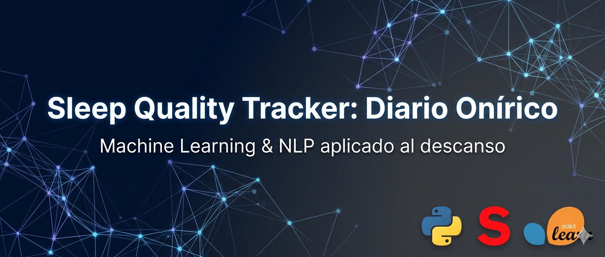

# Sleep Quality Tracker — Diario Onírico. 

>Registra y lleva un historial de la calidad de tu sueño, genera métricas de la calidad predicha y analiza los temas recurrentes mediante modelado de temas.


## Sobre el proyecto
 ### Sleep Quality Tracker — Diario Onírico es un dashboard web diseñado para registrar experiencias oníricas y clasificar la calidad del descanso mediante Inteligencia Artificial. El sistema permite seleccionar hábitos pre-sueño para identificar correlaciones que mejoren la higiene del descanso. Además, mediante el registro de la narrativa onírica, el sistema genera un análisis de tópicos recurrentes, permitiendo al usuario reconocer patrones y temas frecuentes en sus sueños de manera automatizada.   
-----------
## 🌙 ¿Por qué usar Sleep Quality Tracker — Diario Onírico.?

Sleep Quality Tracker transforma tu diario de sueños en una herramienta inteligente de análisis personal. No solo registra cómo dormiste, convierte tus experiencias nocturnas en información útil y accionable.

Beneficios Clave 🚀:

1. Seguimiento inteligente de la calidad del sueño 📈 

El sistema genera una predicción de la calidad del sueño basada en modelos de Machine Learning, permitiendo visualizar tendencias y variaciones a lo largo del tiempo.

2. Análisis automático de patrones y temas 🧠 

Mediante modelado de lenguaje natural, identifica temas recurrentes en tus sueños y los relaciona con distintos niveles de calidad de descanso.

Esto permite descubrir relaciones como:

Temas asociados a noches de sueño profundo.

Patrones frecuentes en noches de baja calidad.

Tendencias emocionales reflejadas en el contenido onírico.

3. Visualización histórica y métricas evolutivas 📊 

El historial acumulado permite observar progresos, detectar cambios y evaluar el impacto de nuevos hábitos de sueño.

4. De experiencia subjetiva a datos analizables 🔍

Sleep Quality Tracker convierte descripciones narrativas en datos estructurados, facilitando el autoconocimiento a través de analítica basada en ML.

5. Optimización progresiva del descanso 🌱 

Al comprender qué patrones están asociados a mejores o peores noches, el usuario puede ajustar rutinas y mejorar su higiene del sueño de forma más consciente.

--------------

## ⚙️ ¿Cómo funciona?
El sistema te guía paso a paso para transformar tus sensaciones en datos útiles para tu bienestar:
1. Medición de Pulso 💓: Usá el cronómetro integrado de 15 segundos para contar tus pulsaciones y la app calculará automáticamente tu ritmo cardíaco.
2. Tu Nivel de Estrés 🧠: Podés registrar cómo te sentís de forma rápida o responder un breve cuestionario que te ayudará a identificar tu carga mental.
3. Diario de Hábitos y Sueño 📝: Cargás tus horas de descanso y seleccionás qué hiciste antes de dormir (¿Tomaste café? ¿Leíste un libro? ¿Usaste el celular?). Esto sirve para identificar qué rutinas te ayudan a descansar mejor.
4. Tu Relato Onírico 🌙: Escribís lo que recordás de tus sueños. La narrativa es clave para descubrir qué temas ocupan tu mente mientras descansás.
5. Predicción e Inteligencia 🔍:
Tu Calidad: La IA analiza tus datos y te da una estimación sobre la calidad de tu descanso.
Tus Temas: El sistema agrupa tus relatos para mostrarte cuáles son los temas que más se repiten en tus sueños "buenos", "regulares" y "malos".

> 💡 **Nota:** Para su correcto funcionamiento, se recomienda registrar los datos en el sistema inmediatamente **al despertar**.

-------------

## 🚀 Instalación y Uso

Para correr este proyecto localmente:
1. Clonar el repositorio:
```
git clone https://github.com/juancaalcaraz/SleepTracker.git
cd SleepTracker
```
2. Crear entorno virtual:
```
python -m venv venv
source venv/bin/activate  # En Windows: venv\Scripts\activate
```
3. Instalar dependencias:
```
pip install -r requirements.txt
```
4. Ejecutar la App:
```
streamlit run app.py
```

-------------

## 🛠️ Stack Tecnológico y Arquitectura
- Lenguaje: Python 3.9+
- Interfaz: Streamlit (Dashboard interactivo y ligero).
- Machine Learning: Scikit-learn (Random Forest Classifier).
- NLP (Procesamiento de Lenguaje): TF-IDF Vectorization con N-grams (1, 2) para análisis de narrativa onírica.
- Visualización: Altair (Gráficos dinámicos y reactivos).
- Almacenamiento: Pandas (Gestión de base de datos local en CSV optimizada para baja memoria).

--------------- 

## Limitaciones 🧪

### Limitaciones del Modelo ⚠️ 

Como todo sistema basado en Machine Learning, este proyecto presenta ciertas limitaciones que deben considerarse al interpretar sus resultados:

- **Dataset reducido:** El modelo fue entrenado con un conjunto de datos limitado (uso personal / experimental), lo que puede afectar su capacidad de generalización.
- **Subjetividad en las etiquetas:** La calidad del sueño registrada depende de la autopercepción del usuario, lo que introduce variabilidad subjetiva.
- **Variables limitadas para la clasificación:**  
  Actualmente, el modelo utiliza únicamente:
  - Frecuencia cardíaca
  - Nivel de estrés
  - Horas dormidas  

  Esto permite una **aproximación razonable al estado general de descanso**, pero no contempla métricas fisiológicas avanzadas como variabilidad de la frecuencia cardíaca (HRV), actividad cerebral (EEG), ciclos REM o mediciones clínicas especializadas.
- **No es un diagnóstico médico:**  
  Debido a la simplicidad del modelo y a la naturaleza de los datos utilizados, los resultados deben interpretarse como una estimación orientativa y no como una evaluación clínica definitiva.
- **No validado en población clínica:**  
  El modelo no ha sido probado en contextos médicos ni con pacientes diagnosticados con trastornos del sueño.

> Este sistema está diseñado como herramienta exploratoria y de autoconocimiento, no como instrumento médico.

------------------

## Privacidad y Datos 🔒 

### Privacidad 🔐

La privacidad del usuario es una prioridad en el diseño del sistema.

- Los datos se almacenan **localmente** en archivos CSV.
- No se envía información a servidores externos.
- No se recopilan datos personales identificables.
- No se utilizan servicios de terceros para procesamiento o almacenamiento.

El proyecto funciona completamente en entorno local, lo que garantiza que el usuario mantiene control total sobre su información.

> Sleep Quality Tracker está diseñado como una herramienta personal de análisis, priorizando simplicidad, transparencia y control de datos.

-----------------

## ⚠️ Health & Medical Disclaimer / Descargo de Responsabilidad Médica

### English

Sleep Quality Tracker — Diario Onírico is a data analysis and predictive modeling tool designed for informational and research purposes only.

The predictions generated by this system are based on machine learning models and statistical inference. They are not medical evaluations and must not be interpreted as clinical diagnoses.

SleepTracker does not replace professional medical advice, diagnosis, or treatment. 
Users should consult a qualified healthcare professional regarding any sleep disorders or health-related concerns.

By using this software, you acknowledge and agree that:

- You understand this is not a certified medical device.
- You will not use it for medical decision-making.
- The author assumes no responsibility for actions taken based on model outputs.

---

### Español

Sleep Quality Tracker — Diario Onírico es una herramienta de análisis de datos y modelado predictivo diseñada únicamente con fines informativos y de investigación.

Las predicciones generadas por este sistema se basan en modelos de aprendizaje automático e inferencia estadística. No son evaluaciones médicas y no deben interpretarse como diagnósticos clínicos.

SleepTracker no reemplaza el consejo, diagnóstico o tratamiento profesional de un médico. 
Los usuarios deben consultar a un profesional de la salud calificado respecto a cualquier trastorno del sueño o problema relacionado con la salud.

Al utilizar este software, usted reconoce y acepta que:

- Entiende que esto no es un dispositivo médico certificado.
- No lo utilizará para tomar decisiones médicas.
- El autor no asume ninguna responsabilidad por acciones tomadas basadas en los resultados del modelo.


## Contact/ Contacto
You can also reach me via LinkedIn/ Puedes contactarme via LinkedIn: [**User LinkedIn**](https://www.linkedin.com/in/juan-carlos-alcaraz-424a571b4/) 

Or via E-mail: 


-----------------
# Sobre mí

¡Hola! Me llamo Juan Alcaraz y soy Técnico Superior en Ciencias de Datos e Inteligencia Artificial. Desarrollo soluciones de automatización para análisis y reporting. Creo dashboards para la toma de decisiones estratégicas. Aplico soluciones de Inteligencia Artificial y entreno modelos de Machine Learning y Deep Learning para los negocios que lo requieran. 

